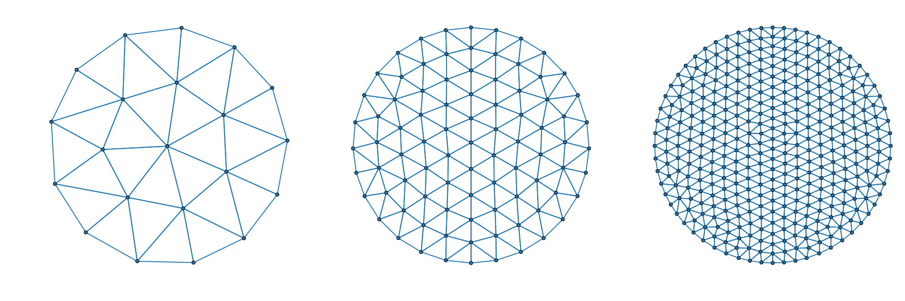
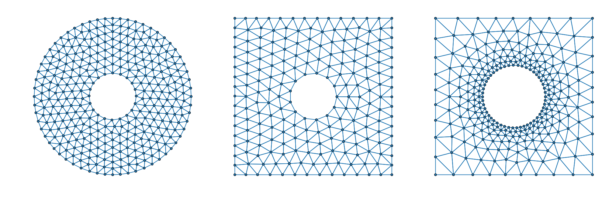

# SimpleDistMesh.jl

[](https://alex-nunn.github.io/SimpleDistMesh/)

A Julia implementation of [DistMesh](http://persson.berkeley.edu/distmesh/), a simple signed distance function meshing algorithm developed by [Per-Olof Persson](http://persson.berkeley.edu/).

 Given the importance of mesh generation across a broad range of discplines, _"the ability to understand and adapt mesh generation code is too valuable an option to lose."_ [1] Thus, a motivation for the DistMesh algorithm is to provide a simple meshing algorithm capable of producing high quality meshes, easily understood and modified by newcomers. 
 
In keeping with this goal our implementation sacrifices performance in favor of readability. Also, some minor changes have been made to the MATLAB implementation to express the ideas more idiomatically in Julia. For implementation details see [`src/distmesh.jl`](src/distmesh.jl) in this repository or, preferably, the original paper by Persson & Strang. [1]

## Usage
Regions are defined by signed distance functions $d(x)$ where the boundary is given by the level set $d(x) = 0$, the function is negative in the interior of the region, and positive outside. For example, the signed distance function $d(x)$ for a disk of radius $1$ is given by,

$$ d(x) = \| x \|_2 - 1.$$ 

For convenience, we have defined the types `Circle`, `Rect`, `Polygon` and `ImplicitRegion` which allow the users to quickly regions. The regions defined by these signed distance functions can also be combined using the set operations; `union`, `intersection` and `setdiff`. See examples in the documentation for more details.

Users can use `Plots.jl` and `plot(mesh)` to visualise the meshes.

### Creating disks of increasing discretisation
```julia
d = Circle([0.0, 0.0], 1)  # create signed distance function
h = x -> 1.0               # element-size distribution
bounds = [-1 -1; 1 1]      # bounds for initial node distributino

h0s = [0.4, 0.2, 0.1]      # initial element sizes
meshes = [Mesh(d, h, h0, bounds) for h0 ∈ h0s]
```



### Combining regions

**Circular annulus,**
```julia
c_outer = Circle([0.0, 0.0], 1)
c_inner = Circle([0.0, 0.0], 0.3)
d = setdiff(c_outer, c_inner)
h = x -> 1.0
h0 = 0.1
bounds = [-1 -1; 1 1]
mesh1 = Mesh(d, h, h0, bounds)
```

**Square with a hole,**
```julia
square = Rect(-1, 1, -1, 1)
hole = Circle([0.0, 0.0], 0.3)
d = setdiff(square, hole)
h = x -> 1.0
h0 = 0.15
bounds = [-1 -1; 1 1]
fixed_nodes = [-1 -1 1 1; -1 1 -1 1]
mesh2 = Mesh(d, h, h0, bounds; fixed_nodes)
```

**Square with a hole and adaptive element sizing,**
```julia
square = Rect(-1, 1, -1, 1)
hole = Circle([0.0, 0.0], 0.4)
d = setdiff(square, hole)
h = x -> min(0.2 + norm(x) - 0.4, 1)
h0 = 0.05
bounds = [-1 -1; 1 1]
fixed_nodes = [-1 -1 1 1; -1 1 -1 1]
mesh3 = Mesh(d, h, h0, bounds; fixed_nodes)
```




## References
[1] [Persson, P. O., & Strang, G. (2004). A simple mesh generator in MATLAB. SIAM review, 46(2), 329-345.](https://doi.org/10.1137/S0036144503429121)

[2] [Persson, P. O. (2005). Mesh generation for implicit geometries (Doctoral dissertation, Massachusetts Institute of Technology).](http://dspace.mit.edu/handle/1721.1/27866)