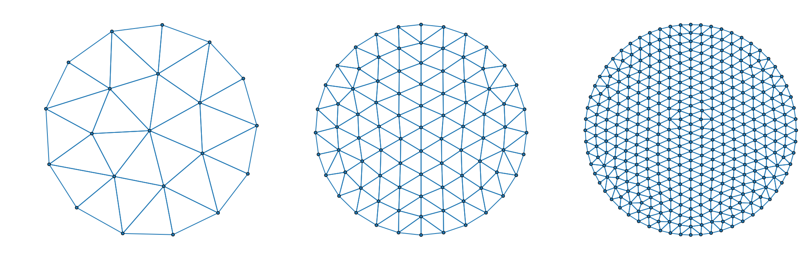

# Examples
These examples are derived from the original DistMesh paper by Persson & Strang. [1] 

## Increasing discretization
The initial element size parameter `h0` and the desired element size distribution `h(x)` control the level of mesh discretization.

```julia
d = Circle([0.0, 0.0], 1)  # create signed distance function
h = x -> 1.0               # element-size distribution
bounds = [-1 -1; 1 1]      # bounds for initial node distributino

h0s = [0.4, 0.2, 0.1]      # initial element sizes
meshes = [Mesh(d, h, h0, bounds) for h0 ∈ h0s]
```



# Combining regions
The regions represented by signed distance functions can easily be combined by taking unions, intersections and differences. In practice this is done by taking the minimum and maximum of a collection of signed distance functions

```math
\begin{aligned}
(d_1 \cup d_2)(x) &= \min \{ d_1(x), \, d_2(x) \},\\
(d_1 \cap d_2)(x) &= \max \{ d_1(x), \, d_2(x) \},\\
(d_1 \\ d_2)(x) &= \max \{ d_1(x), \, -d_2(x) \}
\end{aligned}
```


In practice, you can use the operators `∪`, `∩` and `setdiff` to combine signed distance functions.

**Circular annulus,**
```julia
c_outer = Circle([0.0, 0.0], 1)
c_inner = Circle([0.0, 0.0], 0.3)
d = setdiff(c_outer, c_inner)
h = x -> 1.0
h0 = 0.1
bounds = [-1 -1; 1 1]
mesh1 = Mesh(d, h, h0, bounds)
```

**Square with a hole,**
```julia
square = Rect(-1, 1, -1, 1)
hole = Circle([0.0, 0.0], 0.3)
d = setdiff(square, hole)
h = x -> 1.0
h0 = 0.15
bounds = [-1 -1; 1 1]
fixed_nodes = [-1 -1 1 1; -1 1 -1 1]
mesh2 = Mesh(d, h, h0, bounds; fixed_nodes)
```

**Square with a hole and adaptive element sizing,**
```julia
square = Rect(-1, 1, -1, 1)
hole = Circle([0.0, 0.0], 0.4)
d = setdiff(square, hole)
h = x -> min(0.2 + norm(x) - 0.4, 1)
h0 = 0.05
bounds = [-1 -1; 1 1]
fixed_nodes = [-1 -1 1 1; -1 1 -1 1]
mesh3 = Mesh(d, h, h0, bounds; fixed_nodes)
```


## Complex geometries & adaptive element sizes


**Making hexagons,**
```julia
hexagon = (;l, ϕ0) -> Polygon(
    stack((l * cos(ϕ), l * sin(ϕ)) for ϕ ∈ ϕ0 .+ range(0, 2π, 7)[begin:end-1])
)

outer_hexagon = hexagon(l=1.0, ϕ0=0)
inner_hexagon = hexagon(l=0.5, ϕ0=π/6)

d = setdiff(outer_hexagon, inner_hexagon)
h = x -> 1
h0 = 0.1
bounds = transpose(stack(extrema(outer_hexagon.nodes; dims=2);dims=1))
fixed_nodes = inner_hexagon.nodes

mesh1 = Mesh(d, h, h0, bounds; fixed_nodes)
```

**Adapting element sizes to geometry,**
```julia
upper_half_plane = x -> -x[2]
d1 = Circle([0, 0], 1)
d2 = Circle([-0.4, 0.0], 0.55)
d = setdiff(d1, d2) ∩ upper_half_plane

h1 = x -> 0.15 - 0.2d1(x)
h2 = x -> 0.06 + 0.2d2(x)
h3 = x -> (d2(x) - d1(x)) / 3

h = x -> min(h1(x), h2(x), h3(x))
h0 = 0.05 / 3
bounds = [-1 0; 1 1]
fixed_nodes = [
    -1.0 -0.95 0.15 1.0
     0.0  0.00 0.00 0.0
]

mesh2 = Mesh(d, h, h0, bounds; fixed_nodes)
```


## Implicit geometries

**Meshing super-ellipses,**
```julia
d = setdiff(
    ImplicitRegion(x -> norm(x, 4) - 1),
    ImplicitRegion(x -> norm(x, 4) - 0.5)
)

h = x -> 1
h0 = 0.1
bounds = [-1 -1; 1 1]

mesh1 = Mesh(d, h, h0, bounds)
```

**Weird implicit regions,**
```julia
d = ImplicitRegion(x -> x[2] - cos(x[1])) ∩ ImplicitRegion(x -> -x[2] + 5((2 * x[1] / (5π))^4 - 1))
h = x -> 1
h0 = 0.6
bounds = [-5π/2 -5; 5π/2 1]
fixed_nodes = [-5π/2 5π/2; 0 0]

mesh2 = Mesh(d, h, h0, bounds; fixed_nodes)
```


## All together now!
All of these techniques can be combined to create the mesh of your dreams, 😴❤️❤️

```julia
r = norm([-4, 0] - [1.0, 0.5])
ϕ = atan(1.5, 5)

d1 = Polygon([
    -4.0  1.0  1.0  0.0  1.0  1.0
     0.0  1.5  0.5  0.0 -0.5 -1.5
]) ∩ Circle([-4, 0], r)
d2 = Circle([-1.0, 0.0], 0.5)


d = setdiff(d1, d2)
h1 = x -> clamp(0.7norm(x), 0.1, 0.8)
h2 = x -> 0.2 + d2(x)
h = x -> min(h1(x), h2(x))

h0 = 0.03
bounds = [-4 -1.5; 1 1.5]

fixed_nodes = stack([
    [-4.0, 0.0],
    [1.0, 0.5],
    [1.0, -0.5],
    [0.0, 0.0],
    [r * cos(ϕ) - 4, r * sin(ϕ)],
    [r * cos(ϕ) - 4, -r * sin(ϕ)]
])

mesh = Mesh(d, h, h0, bounds; fixed_nodes)
```


## References
[1] [Persson, P. O., & Strang, G. (2004). A simple mesh generator in MATLAB. SIAM review, 46(2), 329-345.](https://doi.org/10.1137/S0036144503429121)